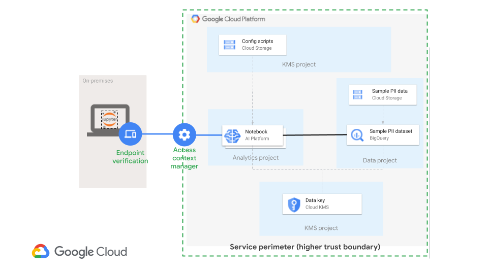

# AI Platform Notebook Security Blueprint: Protecting PII Data

This repository provides an opinionated way to set up AI Platform Notebook in a secure way using Terraform.

**This is not an officially supported Google product**

## Reference Architecture



The resources that this module will create are:

- One AI Platform Notebook per Notebook user
- Service Account for Notebooks
- an HSM key used for Customer Managed Encryption Keys (CMEK) in each Notebook
- Custom Role to restrict exporting data
- Google Cloud Storage bucket with bootstrap code for Notebooks
- Org Policies at the folder that the `trusted-data` project is in
  - `constraints/gcp.resourceLocations`
  - `constraints/iam.disableServiceAccountCreation`
  - `constraints/iam.disableServiceAccountKeyCreation`
  - `constraints/iam.automaticIamGrantsForDefaultServiceAccounts`
  - `constraints/compute.requireOsLogin`
  - `constraints/compute.restrictProtocolForwardingCreationForTypes`
  - `constraints/compute.restrictSharedVpcSubnetworks`

## Assumptions

*   You have your Project and network configuration available for where you want to deploy your trusted environment.
*   You have the appropriate IAM permissions to configure project resources (see [service account roles](#service-account)).
*   You have an IAM Group and list of identities that is allowed to access the trusted environment.
*   You are familiar with your organization's security best practices and policies.  Learn about Google Cloud security foundation best practices by reading the [security foundation blueprint](https://github.com/terraform-google-modules/terraform-example-foundation).

## Prerequisites

### Prepare your admin workstation
You can use Cloud Shell, a local machine or VM as your admin workstation

####
[**Tools for Cloud Shell as your Admin workstation**](#tools-for-cloud-shell-as-your-admin-workstation)

*   [Terraform >= 0.12.3](https://www.terraform.io/downloads.html)
*   [Terraform Provider for GCP][terraform-provider-gcp] plugin v3.51

####
[**Tools for a local workstation as your Admin workstation**](#tools-for-a-local-workstation-as-your-admin-workstation)

*   [Cloud SDK (gcloud CLI)](https://cloud.google.com/sdk/docs/quickstarts)
*   [Terraform >= 0.12.3](https://www.terraform.io/downloads.html)
*   [Terraform Provider for GCP][terraform-provider-gcp] plugin v3.51

####
**Installation instructions for Tools for your environment**


#####
[Install Cloud SDK](#install-cloud-sdk)


This is pre installed if you are using Cloud Shell

The Google Cloud SDK is used to interact with your GCP resources. [Installation instructions](https://cloud.google.com/sdk/downloads) for multiple platforms are available online.

#####
[Install Terraform](https://www.terraform.io/intro/getting-started/install.html)

Terraform is used to automate the manipulation of cloud infrastructure. Its [installation instructions](https://www.terraform.io/intro/getting-started/install.html) are also available online.
When configuring terraform for use with Google cloud create a service account as detailed in [Getting started with the google provider](https://www.terraform.io/docs/providers/google/guides/getting_started.html#adding-credentials)


#### **Authentication**

After installing the gcloud SDK run gcloud init to set up the gcloud cli. When executing choose the correct region and zone

'gcloud init'

Ensure you are using the correct project  . Replace my-project-name with the name of your project

Where the project name is my-project-name

`gcloud config set project my-project-name`


## Compatibility

This module is meant for use with Terraform 0.12. Learn how to [upgraded](https://www.terraform.io/upgrade-guides/0-12.html) to the required version.

## Usage

Basic usage of this module is as follows:

```hcl
module "notebooks_blueprint_security" {
  source  = "GoogleCloudPlatform/notebooks-blueprint-security/google"

  vpc_perimeter_regions           = ["US", "DE"]
  vpc_perimeter_policy_name       = "higher_trust_perimeter_policy"
  vpc_perimeter_ip_subnetworks    = ["NETWORK_CIDR"]  # allowed to access VPC-SC perimeters
  zone                            = "us-central1-a"
  resource_locations              = ["in:us-locations", "in:eu-locations"]
  notebook_key_name               = "trusted-data-key"
  dataset_id                      = "sample_ds_for_notebooks"
  notebook_name_prefix            = "trusted-sample"
  bootstrap_notebooks_bucket_name = "notebook_bootstrap"
  default_policy_id               = "12345678"  # likely org id
  project_trusted_analytics       = "trusted-analytics"
  project_trusted_data            = "trusted-data"
  project_trusted_kms             = "trusted-kms"
  trusted_private_network         = "projects/<shared-restricted-prj>/global/networks/<your_vpc>"
  trusted_private_subnet          = "projects/<shared-restricted-prj>/regions/<region>/subnetworks/<your_subnets_for_notebooks>"
  confidential_groups             = ["group:data-owners@example.com", "group:trusted-data-scientists@example.com"]
  trusted_scientists              = ["user:trusted1@example.com", "user:trusted2@example.com"]
}
```

1. Create a tfvars file with the required inputs (see [Inputs](#inputs) section below)
2. `terraform init ` to get the plugins
3. `terraform plan  -var-file="YOUR_FILE.tfvars"` to see the infrastructure plan.  Note: Replace `YOUR_file` with the name of your tfvars file from the first step
4. `terraform apply  -var-file="YOUR_FILE.tfvars"` to apply the infrastructure build. Note: Replace `YOUR_file` with the name of your tfvars file from the first step

5. Access your AI Platform Notebook
    * establish an [SSH tunnel](https://cloud.google.com/ai-platform/notebooks/docs/ssh-access) from your device to your AI Platform Notebook
    * in your browser, visit `http://localhost:8080` to access your AI Platform Notebook

Be sure to specify your `PROJECT_ID`, `DATASET`, and `TABLE` below, which should match your terraform.tfvars file.
```
%%bigquery
SELECT
  *
FROM `PROJECT_ID.DATASET.TABLE`
LIMIT 10
```

1. `terraform destroy  -var-file="YOUR_FILE.tfvars"` to destroy the built infrastructure. Note: Replace `YOUR_file` with the name of your tfvars file from the first step

### Adding identities to groups
1.  You may need to add service accounts the appropriate IAM high trust data scientist group.
```
# please change the values below to your specific values
gcloud identity groups memberships add --group-email grp-trusted-data-scientists@example.com --member-email = sa-p-notebook-compute@<proj>.iam.gserviceaccount.com
```

### Accessing Notebooks
Use ssh to access your notebook.  Notebooks have no external IP and users should not impersonate the Notebook service account.
Learn how to open an ssh tunnel to launch JuptyerLab, by reading the [SSH to access JupyterLab article](https://cloud.google.com/ai-platform/notebooks/docs/ssh-access).


Functional examples are included in the
[examples](./examples/) directory.


## Inputs

<!-- BEGINNING OF PRE-COMMIT-TERRAFORM DOCS HOOK -->
## Inputs

| Name | Description | Type | Default | Required |
|------|-------------|------|---------|:--------:|
| bootstrap\_notebooks\_bucket\_name | Bucket name to create bootstrap scripts for notebooks. | `string` | `"notebook_bootstrap"` | no |
| confidential\_groups | The list of groups allowed to access PII data. | `list(string)` | n/a | yes |
| dataset\_id | BigQuery dataset ID with PII data that your scientists need to access from their Notebook. | `string` | n/a | yes |
| default\_policy\_id | The id of the default org policy. | `string` | n/a | yes |
| notebook\_key\_name | HSM key used to protect PII data in Notebooks. | `string` | `"trusted-data-key"` | no |
| notebook\_name\_prefix | Prefix for notebooks indicating in higher trusted environment. | `string` | `"trusted-sample"` | no |
| project\_trusted\_analytics | The trusted project for analytics activities and data scientists. | `string` | n/a | yes |
| project\_trusted\_data | The trusted project that has PII data for notebooks. | `string` | n/a | yes |
| project\_trusted\_kms | Top level trusted environment folder that will house the encryption keys. | `string` | n/a | yes |
| resource\_locations | The locations used in org policy to limit where resources can be provisioned. | `list(string)` | <pre>[<br>  "in:us-locations",<br>  "in:eu-locations"<br>]</pre> | no |
| trusted\_private\_network | Network with no external IP for Notebooks.  Should be a restricted private VPC. | `string` | n/a | yes |
| trusted\_private\_subnet | Subnet with no external IP for Notebooks.  Should be part of a restricted private network and have logs and private network enabled. | `string` | n/a | yes |
| trusted\_scientists | The list of trusted users. | `list(string)` | n/a | yes |
| vpc\_perimeter\_ip\_subnetworks | IP subnets for perimeters. | `list(string)` | n/a | yes |
| vpc\_perimeter\_policy\_name | Policy name for VPC service control perimeter. | `string` | `"higher_trust_perimeter_policy"` | no |
| vpc\_perimeter\_regions | 2 letter identifier for regions allowed for VPC access. A valid ISO 3166-1 alpha-2 code. | `list(string)` | n/a | yes |
| zone | The zone in which to create the secured notebook. Must match the region. | `string` | n/a | yes |

## Outputs

| Name | Description |
|------|-------------|
| access\_level\_name | access level name used in the perimeter policy |
| bkt\_notebooks\_name | name of bootstrap bucket |
| caip\_sa\_email | email of the SA used by CAIP; should not be a default SA |
| folder\_trusted | folder that holds all the trusted projects and constraints |
| notebook\_instances | list of notebooks created (vm names) |
| notebook\_key\_name | name of the key used in the notebooks. |
| notebook\_key\_ring\_name | name of keyring |
| perimeter\_name | vpc-sc perimeter name |
| script\_name | name of the post startup script installed |
| vpc\_perimeter\_resource\_protected | list of projects included in the VPC-Sc perimeter |

<!-- END OF PRE-COMMIT-TERRAFORM DOCS HOOK -->

## Requirements

These sections describe requirements for using this module.

### Software

The following dependencies must be available:

- [Terraform][terraform] v0.12
- [Terraform Provider for GCP][terraform-provider-gcp] plugin v3.51

### Service Account

A service account with the following roles must be used to provision
the resources of this module:

Organization Level
- Access Context Manager Policy Admin: `roles/accesscontextmanager.policyAdmin`
- Organization Policy Admin: `roles/orgpolicy.policyAdmin`
- Security Admin: `roles/iam.securityAdmin`
- Service Usage Consumer: `roles/serviceusage.serviceUsageConsumer`

Restricted Shared VPC Project (created in blueprint foundation)
- Network Admin: `compute.networkAdmin`

Analytics Project
- Service Account Creator: `roles/iam.serviceAccountCreator`
- Cloud KMS Admin: `roles/cloudkms.admin`
- Compute Instance Admin: `roles/compute.admin`
- BigQuery Job User: `roles/bigquery.jobUser`
- BigQuery User: `roles/bigquery.user`
- Notebooks Runner: `roles/notebooks.runner`
- Service Account User: `roles/iam.serviceAccountUser`
- Service Usage Admin: `roles/serviceusage.serviceUsageAdmin`

Data Project
- BigQuery Job User: `roles/bigquery.jobUser`
- BigQuery User: `roles/bigquery.user`
- Role Administrator: `roles/iam.roleAdmin`
- Storage Admin: `roles/storage.admin`

KMS Project
- Cloud KMS Admin: `roles/cloudkms.admin`

The [Project Factory module][project-factory-module] and the
[IAM module][iam-module] may be used in combination to provision a
service account with the necessary roles applied.

### Enable APIs
In order to operate with the Service Account you must activate the following APIs on the project where analytics and Notebooks reside:

- Access Context Manager API: `accesscontextmanager.googleapis.com`
- BigQuery API: `bigquery.googleapis.com`
- Compute Engine API: `compute.googleapis.com`
- Identity and Access Management (IAM) API: `iam.googleapis.com`
- Key Management Service (KMS) API: `cloudkms.googleapis.com`
- Notebooks (AI Platform) API: `notebooks.googleapis.com`
- Google Cloud Storage API: `storage.googleapis.com`
- Resource Manager API: `cloudresourcemanager.googleapis.com`
- IAM Service Account Credentials API: `iamcredentials.googleapis.com`

In order to operate with the Service Account you must activate the following APIs on the project where your KMS/HSM keys reside:

- Google Cloud Storage API: `storage.googleapis.com`
- Key Management Service (KMS) API: `cloudkms.googleapis.com`


### Resource Hierarchy
Within your Org's prod environment, create a folder to hold your trusted projects and centrally managed your policies for Notebooks that use PII data.
Note: the `fldr-prod` is created by the foundation blueprint.  Create folders by using the [project factory](https://github.com/terraform-google-modules/terraform-google-project-factory)

```
fldr-prod
└── fldr-trusted
    ├── trusted-data
    ├── trusted-analytics
    └── trusted-kms
```


## Contributing

Refer to the [contribution guidelines](./CONTRIBUTING.md) for
information on contributing to this module.

[iam-module]: https://registry.terraform.io/modules/terraform-google-modules/iam/google
[project-factory-module]: https://registry.terraform.io/modules/terraform-google-modules/project-factory/google
[terraform-provider-gcp]: https://www.terraform.io/docs/providers/google/index.html
[terraform]: https://www.terraform.io/downloads.html
